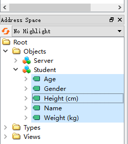
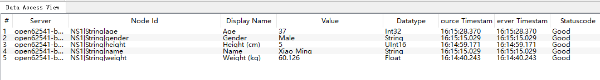

# opcuaServer
A demo opcua server to show the basic usage of open62541.
Easy to use for everyone to adding it to your project.

Implentmented by open62541.  add data model and can be write by client. 


# download open62541 and build && install
```
git clone https://github.com/open62541/open62541.git
cd open62541
mkdir build && cd build
cmake -DCMAKE_BUILD_TYPE=Release \
	  -DUA_ENABLE_AMALGAMATION=ON \
	  -DUA_BUILD_EXAMPLES=OFF

make -j && make install
```
define UA_ENABLE_AMALGAMATION to generate open62541.h 


# build 
type make to build program


# usage
you can add some code to change the value of opcua server by yourself.
When the client modified the value of server, you callback function will be actived.


age height weight can be modified by opcua client.


When opcua client modified the value, opcua server will execute callback function to do some thing.


# reference 
https://github.com/open62541/open62541
https://wanghao1314.blog.csdn.net/article/details/101567275
https://blog.csdn.net/v6543210/article/details/124609569


